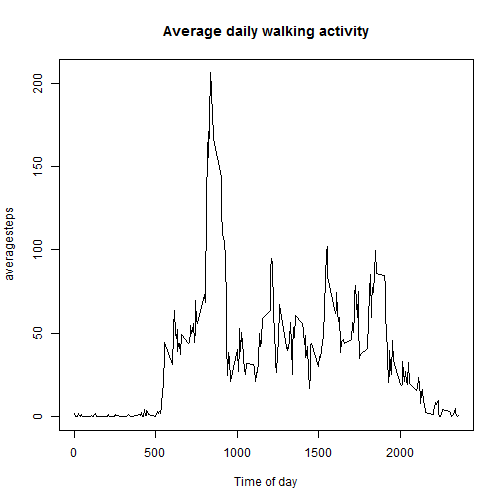

# Personal Activity Monitoring Device Data #

## Loading and preprocessing the data ##

```r
activity <- read.csv('activity.csv')
cleaned <- activity[complete.cases(activity),]
options("scipen" = 100)     # numeric values print in standard notation
```

## What is mean total number of steps taken per day? ##

```r
stepsperday <- tapply(cleaned$step, cleaned$date, sum)
hist(stepsperday, breaks = 10, xlab="Steps per day",
     main="Distribution of number of daily steps with available data")
```


```r
stepsmean <- mean(stepsperday, na.rm=TRUE)
stepsmedian <- median(stepsperday, na.rm=TRUE)
```
Mean steps taken per day: 10766.1886792

Median steps for all the days: 10765

## What is the average daily activity pattern? ##

```r
averagesteps <- tapply(cleaned$steps, cleaned$interval, mean)
plot(unique(cleaned$interval), averagesteps, type="l", xlab="Time of day")
title("Average daily walking activity")
```



```r
maxsteps <- max(averagesteps)
ms_interval <- as.numeric(names(which.max(averagesteps)))
```
The interval with the most steps on the subject's average day is 835. The average amount of steps during that interval is 206.1698113.

## Imputing missing values ##

```r
filled <- activity
filled[!complete.cases(filled),]$steps <- as.numeric(averagesteps)
totalsteps <- tapply(filled$steps, filled$date, sum)
hist(totalsteps, breaks=10, xlab="Total steps",
     main="Distribution of number of daily steps when improvised data added")
```


```r
totalmean <- mean(totalsteps)
totalmedian <- median(totalsteps)
```
When we replace blank data for the days we don't have records for with the mean data we have for each interval on the days we do have records for, the mean total number of steps each day is 10766.1886792, and the median total number of steps each day is 10766.1886792.


## Are there differences in activity patterns between weekdays and weekends? ##

```r
partofweek = function(day) {
        parts <- factor(levels = c("weekday","weekend"))
        for (each in day){
                if (each %in% c("Saturday", "Sunday")){
                        parts <- c(parts, "weekend")
                }
                else {
                        parts <- c(parts, "weekday")
                }
        }
        return(as.factor(parts)) # parts was coerced to character()
}
```


```r
library(dplyr)
library(lattice)

filled_posix <- transform(filled, date = as.POSIXct(date))
days <- weekdays(as.POSIXct(filled_posix$date))
weekpart <- partofweek(days)
filled <- mutate(filled, weekday_weekend = weekpart)

agg <- aggregate(steps ~ interval + weekday_weekend, data = filled,
                 FUN = mean)
xyplot(steps ~ interval | weekday_weekend, data = agg, type = "l",
      layout = c(1, 2), ylab = "Steps",
      xlab = "Average daily walking activity")
```


